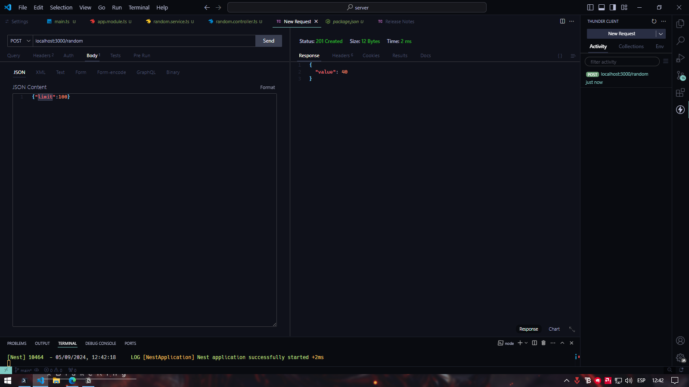
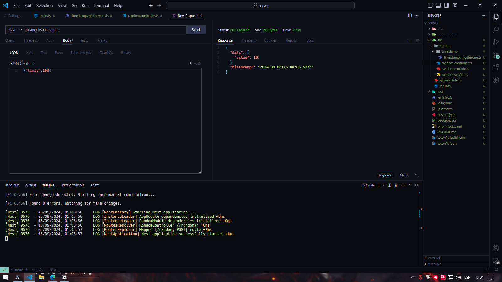
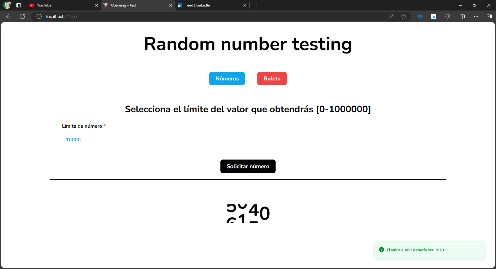
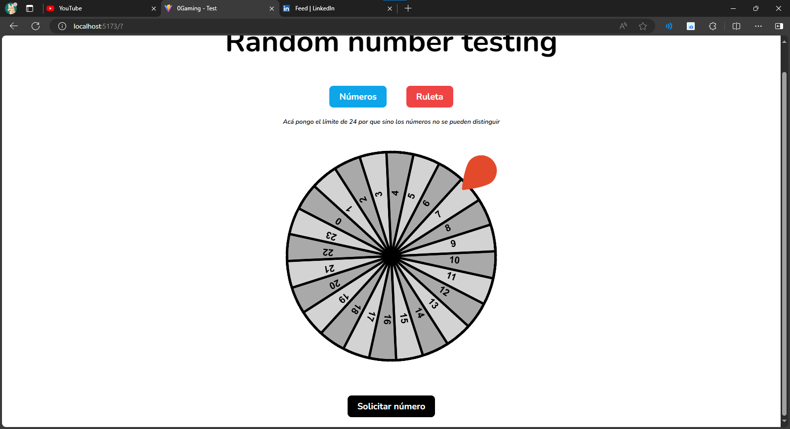

# 0Gaming - Test

### TODO

Desarrollar un servidor API utilizando **NestJS** que responda con un número aleatorio entre 1 y 100 cuando se haga una solicitud a una ruta determinada.

- Implementar una ruta HTTP **POST** que al recibir una solicitud genere un número aleatorio entre 1 y 100. ✅
- La respuesta debe ser un JSON con la siguiente estructura: `{ "value": <número> }`. ✅
- La API debe implementar un **middleware** para registrar el timestamp (marca de tiempo) de cada solicitud. ✅

1. Crear un **frontend mínimo** en **ReactJS** que tenga un botón para realizar una solicitud a esta ruta, y muestre el número aleatorio recibido en pantalla. ✅
2. Si el candidato tiene conocimientos de Docker, se puede agregar un `Dockerfile` para contenerizar la aplicación. _(Estudiar docker)_ ✅
3. _Se valorará el uso de buenas prácticas en la estructura del código y manejo de errores._ ✅
4. _Una vez finalizada, sube el código a un repositorio público en GitHub y envía el enlace junto con el tiempo total que te tomó._ ✅
5. Agrega una animación de una **ruleta** con 100 números, donde se detenga en el número aleatorio generado. Esta animación debe estar en el **frontend**. (Opcional) ✅
6. _Si decides no hacer la ruleta y solo mostrar el número aleatorio, de ser posible, también implementa una animación en el **frontend** que lo presente de manera visualmente atractiva. (Opcional)_ ✅

# Timeline (Jueves 5 de septiembre)

### 11:00 _aproximadamente_:

- Comienzo a estudiar **_NestJS_**

### 12:25:

- Empiezo a practicar en **_NestJS_** y de paso realizar lo que se pide:
- Con ThunderClient verifico que ya responde con un número aleatorio

- Implemento el middleware pedido.

Con esto ya está realizado el backend.

### 13:12:

- busco librerías de ruletas que pueda utilizar para las animaciones.
- _Me descarto por react-awesome-animated-number y react-custom-roulette_

### 14:30 aproximadamente:

- La lógica ya estaría hecha, solo resta hacer que quede bonito.

### 16:41:

- Terminé, solo debo pushear a github y ver la parte del docker.
- Con chatGPT me ayudé para hacer la parte del docker. y ya estaría todo hecho.

## Imágenes del proyecto terminado

